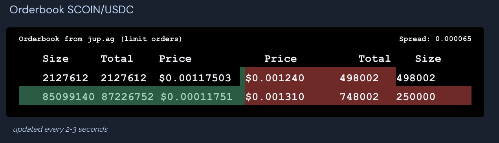

# Market making with Jupiter Limit orders

Do market making with Jupiter Limit orders by setting buy and sell orders and visualize them like a proper DEX order book.

This project provides a React hook to get order book data as well as a UI example and code to set limit orders.

## Buy / Sell scripts

In the `examples` folders you'll find scripts for setting limit buy and sell orders for SCOIN/USDC. Adapt to the coins you want to display.

## Example
[](https://sdrive.app/scoin)

## Live view 
[SCOIN Order Book](https://sdrive.app/scoin)

## Example implementation

In the head of a React component
```
import useJupiterOrderbook, { BidType } from "./useJupiterOrderBook"
```

in the main function
```
export default function Orderbook() {
  const TOKEN = "5qKDWkBejLtRh1UGFV7e58QEkdn2fRyH5ehVXqUYujNW" // SCOIN
  const STABLE = "EPjFWdd5AufqSSqeM2qN1xzybapC8G4wEGGkZwyTDt1v" // USDC
  const AMOUNT = 1000000 // 1 USDC

  const TOKEN_DECIMALS = 1e9
  const STABLE_DECIMALS = 1e6
  const { bids, asks, priceUSDC, tokensfor1USDC }
     = useJupiterOrderbook(TOKEN, STABLE, AMOUNT, TOKEN_DECIMALS, STABLE_DECIMALS)

  let totalBids = 0
  let totalAsks = 0
  let spread = Math.abs(asks[0]?.price - bids[0]?.price).toFixed(6)
```

Then format the order book however you want. Here's an example formatting for USDC/SCOIN used at SDrive.app

```
return (
<div className="px-2 shadow my-2">
    <h1 className="p-1">Orderbook SCOIN/USDC</h1>
    <div
        className="w-fit dark:bg-[#000000] flex flex-col font-bold text-sm dark:text-slate-100 my-2 rounded"
        style={{ fontFamily: "Consolas,Courier New,monospace" }}>
        <div className="text-lg px-4 pt-2 text-xs">
        <div className="flex gap-2 justify-between">
            <div>
            Orderbook from{" "}
            <a className={linkStyle} target="_blank" 
                href="https://jup.ag/swap/USDC-SCOIN_5qKDWkBejLtRh1UGFV7e58QEkdn2fRyH5ehVXqUYujNW">
                jup.ag
            </a>{" "}
            (limit orders)
            </div>
            <div>Spread: {spread}</div>
        </div>
        </div>
        {bids || asks ? <div className="flex px-4 pb-4 py-2 w-[38rem]">
        <div className="w-72">
            <div className="w-full flex gap-2 flex-row-reverse">
            <div className="w-5/12">Price</div>
            <div className="w-3/12">Total</div>
            <div className="w-3/12">Size</div>
            <div className="w-1/12"></div>
            </div>
            {bids.map((bid: BidType, i: number) => {
            totalBids += bid.size
            return (
                <div key={i} className="flex flex-row-reverse justify-between py-1 gap-2 w-72 relative">
                <div className="w-5/12 h-4">${bid.price.toFixed(8)}</div>
                <div className="w-3/12 h-4">{Math.floor(totalBids)}</div>
                <div className="w-3/12 h-4">{Math.floor(bid.size)}</div>
                <div className="w-1/12 h-4"></div>
                <div className="absolute bg-emerald-500/50 h-full z-0 top-0" 
                    style={{ width: `${bid.percentage}%` }}></div>
                </div>
            )
            })}
        </div>
        <div className="w-72">
            <div className="w-full flex 2 ">
            <div className="w-1/12 h-4"></div>
            <div className="w-5/12">Price</div>
            <div className="w-3/12">Total</div>
            <div className="w-3/12">Size</div>
            </div>
            {asks.map((bid: BidType, i: number) => {
            totalAsks += bid.size
            return (
                <div key={i} className="flex 	justify-between py-1 w-72 relative">
                <div className="w-5/12 z-10 h-4">${bid.price.toFixed(6)}</div>
                <div className="w-3/12 z-10 h-4">{Math.floor(totalAsks)}</div>
                <div className="w-3/12 z-10 h-4">{Math.floor(bid.size)}</div>
                <div className="w-1/12 h-4"></div>
                <div className="absolute bg-red-500/50 h-full z-0 top-0" 
                    style={{ width: `${bid.percentage}%` }}></div>
                </div>
            )
            })}
        </div>
        </div>:null}
    </div>
</div>
)
```
